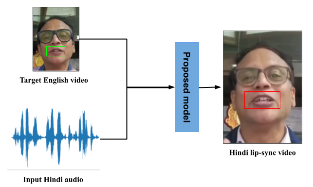
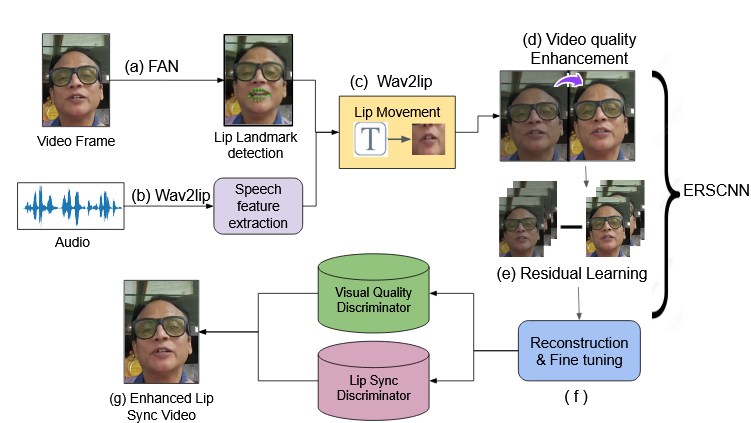
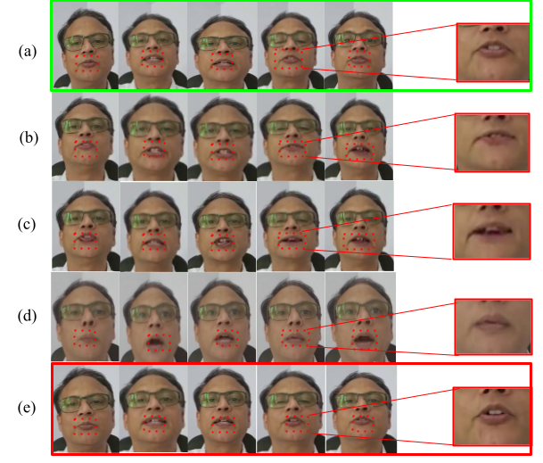

# FAN-Wav2Lip: A Lip Synchronization Model for Hindi To English Dubbing
FAN-Wav2Lip integrates the Wav2Lip model with a Facial Alignment Network (FAN) to improve lip synchronization in dubbed videos. The model generates highly synchronized lip movements for Hindi audio while enhancing video quality using Real-ESRGAN for super-resolution.

<p align="center">
  
</p>

<p align="left"><em>Given a Hindi audio and target English video, our model produces the output video with lip-synchronization for the Hindi language.</em></p>

---

## 🏆 **Key Contributions**
1. **Benchmark Dataset:** Hindi-dubbed videos paired with high-quality annotations for lip synchronization evaluation.
2. **FAN-Wav2Lip Model:** Combines Wav2Lip's audio-visual alignment capabilities with FAN for precise lip landmark detection.
3. **Video Quality Enhancement:** Incorporates Real-ESRGAN to enhance visual quality for a seamless viewing experience.

---

## 📂 **Dataset**
A curated dataset of 100 video clips with diverse linguistic inputs, Hindi subtitles (.srt format), and annotations. [Download Dataset](https://drive.google.com/drive/folders/1cUrcWEcDVC_ED1j3gU7i7YziU0jzjdMM?usp=sharing)


## 🛠 **Model Architecture**

### 1. **Lip Synchronization**
- Input: Hindi audio and English video.
- Uses FAN for detailed lip landmark extraction and Wav2Lip for audio-to-lip alignment.

### 2. **Video Quality Enhancement**
- Real-ESRGAN enhances resolution and reduces artifacts.
- Ensures visually appealing and coherent outputs.

<p align="center">
  
</p>

<p align="left"><em>Block diagram of the intricate details of the proposed model. (a) The Lip landmarks are extracted from the
video frame. (b) The Audio features are extracted from the input audio signal. (c) The synchronized lip movements with
the audio throughout the video are generated from the concatenated input of audio and visual features. (d) The input
low-resolution frames are processed through convolutional layers that capture spatial features to improve quality. (e) The
residuals are calculated by taking the difference between low-resolution frames and desired high-resolution frames and
missing fine details are enhanced. (f) Unnecessary artifacts are removed from the frames to ensure the output is close to
the high-resolution target. (g) The final enhanced lip sync video in Hindi.</em></p>

---

## 🚀 **Performance**

### Quantitative Metrics
| **Model**       | **RLMD** | **LSE** | **SSIM** |
|------------------|----------|---------|----------|
| Wav2Lip          | 0.404    | 0.417   | 0.674    |
| Diff2Lip         | 0.529    | 0.447   | 0.598    |
| FAN-Wav2Lip      | **0.233**| **0.389**| **0.694**|

### Qualitative Evaluation
We conducted a qualitative evaluation where participants rated results produced by our model on a scale of 0-5 on:
1. **Lip-Sync Naturalness:** How well lip movements match audio.
2. **Visual Coherence:** The smoothness and clarity of the video.

|**Set ID**      | **Lip Sync Naturalness**| **Visual Coherence**|
|----------------|-------------------------|---------------------|
| 1              | 4.1                     | 4.2                 | 
| 2              | 4.0                     | 4.1                 |
| 3              | 4.2                     | 4.3                 | 
| 4              | 4.0                     | 4.1                 |
| 5              | 4.3                     | 4.4                 |


### Visual Comparison
The outputs of FAN-Wav2Lip closely resemble the ground truth, outperforming other models:

<p align="center">
  
</p>

<p align="left"><em>Results of lip synchronization generated by various state-of-the-art models using our dataset: (a) Ground truth, (b) Wav2Lip, (c) Diff2Lip, (d) TalkLip, and (e) Proposed approach. As shown, the results produced by our model (e) closely resemble the ground truth (a) compared to the other models.</em></p>

---

## 📊 **Ablation Study**
- Removing Real-ESRGAN results in a **5-10% drop** in PSNR and SSIM scores.
- FAN integration improves RLMD and LSE by **20%**, highlighting the importance of lip landmark accuracy.

---

## 🔧 **Setup & Installation**
1. Clone the repository:
   ```bash
   git clone https://github.com/your-username/FAN-Wav2Lip.git
2. Install dependencies:
    ```
    pip install -r requirements.txt
    ```
3. Download pretrained models and place them in the pretrained directory.

## 🗂 **Pretrained Models**
Download pretrained models used in this project:

1. **Wav2Lip**  
   Repository: [https://github.com/Rudrabha/Wav2Lip](https://github.com/Rudrabha/Wav2Lip)  
   Download Pretrained Model: [Direct Link](https://colab.research.google.com/drive/1IjFW1cLevs6Ouyu4Yht4mnR4yeuMqO7Y#scrollTo=MH1m608OymLH)

2. **Facial Alignment Network (FAN)**  
   Repository: [https://github.com/1adrianb/face-alignment](https://github.com/1adrianb/face-alignment)  
   Download Pretrained Model: [Direct Link](https://github.com/1adrianb/face-alignment/releases)

3. **Real-ESRGAN**  
   Repository: [https://github.com/xinntao/Real-ESRGAN](https://github.com/xinntao/Real-ESRGAN)  
   Download Pretrained Model: [Direct Link](https://github.com/xinntao/Real-ESRGAN/releases/tag/v0.3.0)

Place all downloaded weights into the `pretrained/` directory to ensure the project runs seamlessly.


## 🎥 **Demo**
Experience the lip-synced outputs:
- [YouTube Demo](https://youtu.be/f_LIf5vrR5s)

---

## 🤝 **Citation**
If you use this code, please cite our work:

```bibtex
@article{Sanyal2024FANWav2Lip,
  title={FAN-Wav2Lip: A Lip Synchronization Model for English to Hindi Dubbing},
  author={Samriddha Sanyal, Gouthami Godhala, Vijayasree Asam, Pankaj Jain},
  journal={Preprint submitted to Journal of Visual Communication and Image Representation},
  year={2024}
}
```
---
